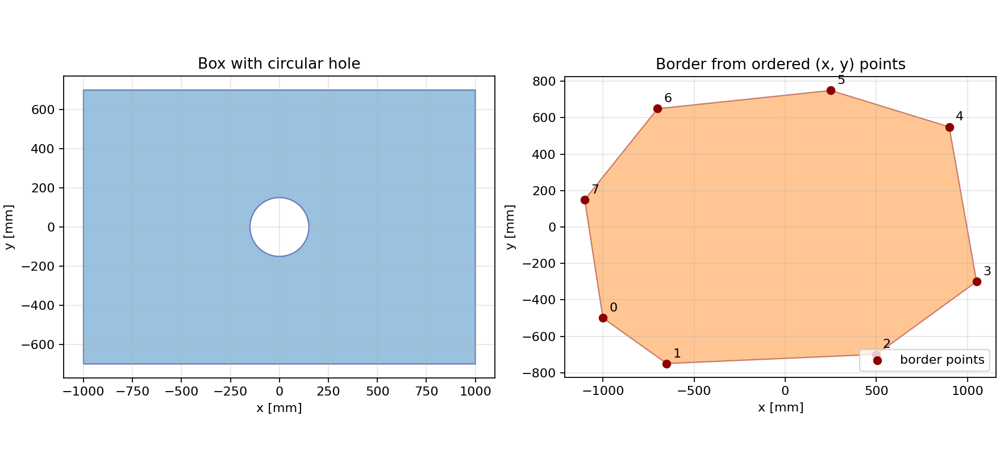

# xyshapes-detectors

Small, standalone [Shapely](https://shapely.readthedocs.io/) generators for
two-dimensional detector-plane acceptances. Geometries are saved as ordinary
Python pickles and can be loaded directly by tracking studies.

The XY geometry and longitudinal placement are intentionally separate:

- these scripts define **where a plane is active in X and Y**;
- the plane CSV defines **where that shape is placed in Z**.

## Installation

```bash
git clone https://github.com/qgl90/xyshapes_detetctors.git
cd xyshapes_detetctors
python -m pip install -e .
```

Python 3.9 or newer is required. The runtime dependencies are Matplotlib,
NumPy, and Shapely 2.

## Simplest example: box with an optional hole

Create a `2000 x 1500 mm` box with an `80 x 60 mm` rectangular beam hole:

```bash
xyshape-box MyUPShape \
    --width 2000 \
    --height 1500 \
    --hole-size 80 60 \
    --output-dir shapes/UP
```

This creates both `shapes/UP/MyUPShape.pickle` and its figure
`shapes/UP/MyUPShape.png`. For a circular hole, replace `--hole-size 80 60`
with `--hole-radius 40`. Omit both options for a solid box.

The same operation from Python is:

```python
from xyshapes_detectors import box_with_hole, dump_geometries

shape = box_with_hole(2000, 1500, hole_width=80, hole_height=60)
dump_geometries({"MyUPShape": shape}, "shapes/UP")
```

A complete runnable version is in
[`examples/create_box_with_hole.py`](examples/create_box_with_hole.py).

## Sketch: circular hole versus point-defined border



For a box with a circular hole:

```python
from xyshapes_detectors import box_with_hole, dump_geometries

shape = box_with_hole(
    width=2000,
    height=1400,
    hole_radius=150,
)
dump_geometries({"BoxWithCircleHole": shape}, "shapes")
```

For an arbitrary border, list the `(x, y)` corners in order while walking
around its perimeter. The closing point does not need to be repeated:

```python
from xyshapes_detectors import dump_geometries, polygon_from_points

border_points = [
    (-1000, -500),
    (-650, -750),
    (500, -700),
    (1050, -300),
    (900, 550),
    (250, 750),
    (-700, 650),
    (-1100, 150),
]

shape = polygon_from_points(border_points)
dump_geometries({"PointDefinedBorder": shape}, "shapes")
```

Point-defined holes are also supported. Each hole is another ordered border:

```python
outer = [(-100, -100), (100, -100), (100, 100), (-100, 100)]
hole = [(-20, -20), (20, -20), (20, 20), (-20, 20)]
shape = polygon_from_points(outer, holes=[hole])
```

Every call to `dump_geometries` writes a PNG figure beside each pickle. The
complete script that creates both pickles and the combined sketch is
[`examples/box_circle_and_points.py`](examples/box_circle_and_points.py):

```bash
python examples/box_circle_and_points.py
```

## Place the shape in Z

The pickle contains no Z coordinate. Reference its filename without the
`.pickle` extension in the `xyshape` column of a plane CSV:

```csv
Use,Z,thickness,sigmaX,sigmaY,angle,xyshape,hiteff
1,2327.5,.02,.055,,0,MyUPShape,1.0
1,2372.5,.02,.055,,5,MyUPShape,1.0
```

Thus, the same XY acceptance can be reused at any number of Z positions. See
[`examples/planes.csv`](examples/planes.csv).

## Built-in detector families

Each family has its own generator:

```bash
xyshape-velo --output-dir shapes/VELO
xyshape-up   --output-dir shapes/UP
xyshape-ft   --output-dir shapes/FT
```

Run all built-in generators together with:

```bash
xyshape-all --output-dir shapes
```

The generators currently reproduce the shapes from the original tracking
study:

- VELO: closed/open, left/right acceptances;
- UP: UTaX, UTaU, UTbV, UTbX, UT Upgrade-II variants;
- FT: SciFi and the Frugal, Modest, and FTDR fibre/pixel variants.

For a new subsystem such as MP, RICH1, RICH2, PicoCal, or MuWELL, the minimal
starting point is `box_with_hole`; more detailed Shapely operations can be put
in a dedicated `create_geom_<detector>.py` module.

## Read and inspect a pickle

```python
from xyshapes_detectors import load_geometry

shape = load_geometry("shapes/UP/MyUPShape.pickle")
print(shape.geom_type)
print(shape.bounds)
print(shape.area)
```

Pickles written here contain Shapely geometry objects and use the same
`pickle.load` mechanism as the original tracking code. As with all Python
pickles, only load files from trusted sources.

Every generated pickle already has a PNG preview beside it. To open an
interactive Matplotlib window instead, use:

```bash
python examples/plot_shape.py shapes/UP/MyUPShape.pickle
```

## Development

```bash
python -m unittest discover -s tests -v
```
